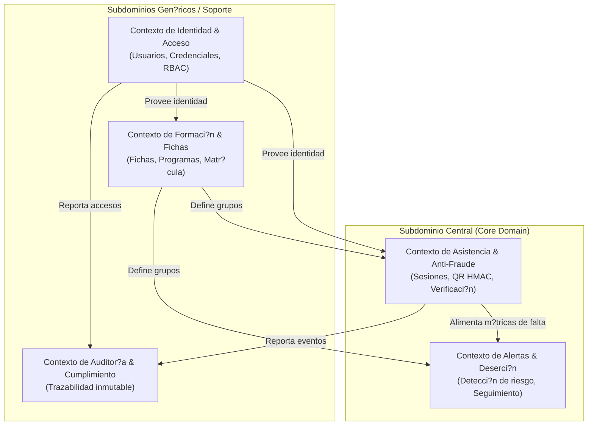

# Mapa de Dominio y Contextos Delimitados

> Estado: ?? Estable | ?ltima actualizaci?n: 2026-09-18
> Autor: Equipo de Desarrollo | Equipo: An?lisis y Desarrollo de Software (SENA)

## 1. Subdominios y Bounded Contexts

El sistema se estructura en 5 contextos delimitados bien diferenciados:

### Descripci?n de Contextos:

1. **Contexto de Asistencia & Anti-Fraude (Core):** Responsable del ciclo de vida de la sesi?n presencial, generaci?n de c?digos ef?meros HMAC, validaci?n de proximidad de red y persistencia del estado de llegada.
2. **Contexto de Alertas & Deserci?n (Core):** Analiza el patr?n hist?rico de faltas de cada aprendiz frente a los umbrales de riesgo, notificando al instructor para intervenci?n oportuna.
3. **Contexto de Identidad & Acceso:** Gesti?n de roles (`admin`, `instructor`, `aprendiz`), autenticaci?n segura y pol?ticas de sesi?n.
4. **Contexto de Formaci?n & Fichas:** Estructuraci?n de fichas de caracterizaci?n, programas formativos y membres?a del aprendiz.
5. **Contexto de Auditor?a:** Bit?cora inmutable de eventos sensibles para garantizar transparencia y no repudio.
