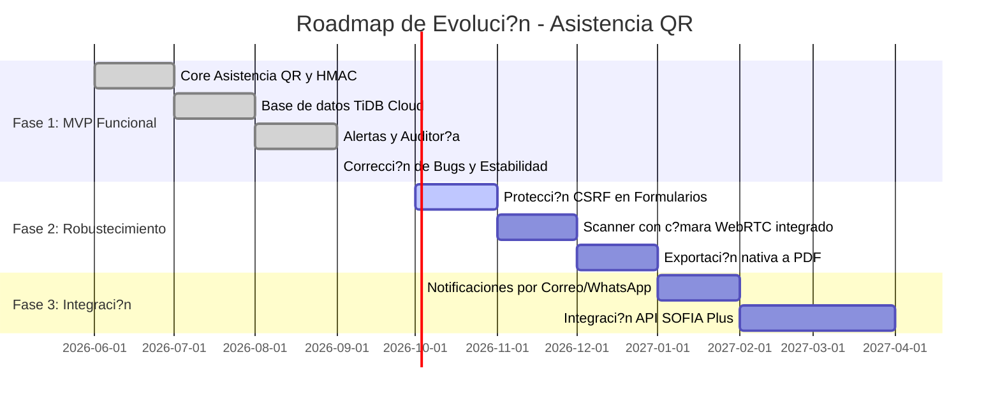

# Roadmap de Producto (Hoja de Ruta)

> Estado: ?? Estable | ?ltima actualizaci?n: 2026-09-18
> Autor: Equipo de Desarrollo | Equipo: An?lisis y Desarrollo de Software (SENA)

### Detalle de Hitos:

- **Hito 1 (Completado): MVP 100% Funcional**
  - Implementaci?n completa de roles (Admin, Instructor, Aprendiz).
  - Algoritmo de QR rotativo HMAC SHA-256 (30s) y vista de proyecci?n.
  - Cierre at?mico con marcaci?n masiva de ausentes.
  - Pool de conexiones a base de datos y auditor?a de eventos.
- **Hito 2 (En Progreso): Experiencia de Usuario Avanzada**
  - Incorporaci?n de lector de c?mara directo en la app web (`html5-qrcode`).
  - Generaci?n de certificados y reportes descargables en PDF.
- **Hito 3 (Futuro): Ecosistema Institucional**
  - Enlace con bases de datos de matr?cula institucional del SENA.
