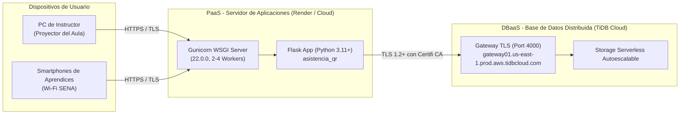

# Topolog?a de Despliegue

> Estado: ?? Estable | ?ltima actualizaci?n: 2026-09-18
> Autor: Equipo de Desarrollo | Equipo: An?lisis y Desarrollo de Software (SENA)

El sistema est? dise?ado para operar tanto en un entorno de desarrollo local como en una infraestructura en la nube moderna de bajo costo (PaaS + Serverless DB):

### Ambientes:

| Ambiente | Host de Aplicaci?n | Base de Datos | Configuraci?n SSL |
|---|---|---|---|
| **Desarrollo Local** | `localhost:5000` (Flask Dev Server) | TiDB Cloud / MySQL Local | `ssl_verify_cert=True`, `certifi` |
| **Producci?n (Render)** | Web Service en Render con Gunicorn | TiDB Cloud Serverless | Forzar HTTPS, `SESSION_COOKIE_SECURE=True` |
