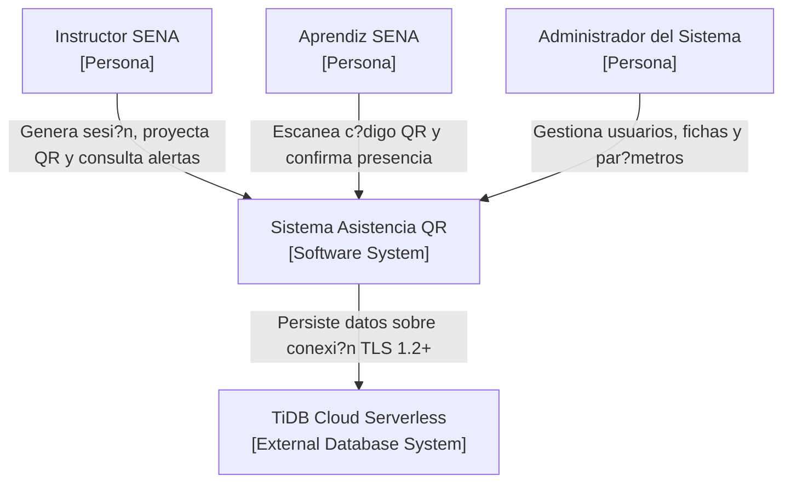
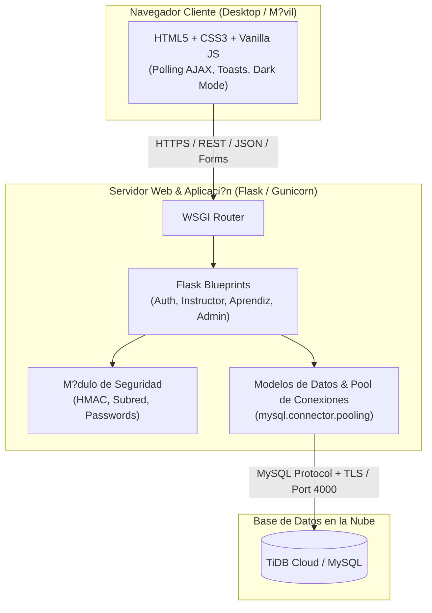

# Vista General de Arquitectura (Modelo C4)

> Estado: ?? Estable | ?ltima actualizaci?n: 2026-09-18
> Autor: Equipo de Desarrollo | Equipo: An?lisis y Desarrollo de Software (SENA)

El sistema **Asistencia QR** sigue una arquitectura limpia basada en el patr?n arquitect?nico **Modelo-Vista-Controlador (MVC)** modularizado mediante Blueprints de Flask.

---

## 1. Nivel 1: Diagrama de Contexto del Sistema

---

## 2. Nivel 2: Diagrama de Contenedores

---

## 3. Nivel 3: Diagrama de Componentes (Controladores)

- `auth_controller.py`: Maneja login, logout y decorador de autorizaci?n `@requiere_rol`.
- `instructor_controller.py`: Coordina la apertura de sesiones, generaci?n de im?genes QR en base64 v?a `qrcode`, polling de registros en tiempo real, correcciones manuales y exportaci?n a Excel con `openpyxl`.
- `aprendiz_controller.py`: Recibe el c?digo ef?mero y orquesta las 5 validaciones anti-fraude antes de registrar la asistencia.
- `admin_controller.py`: Controla la gesti?n de fichas, usuarios, auditor?a forense y par?metros globales.
