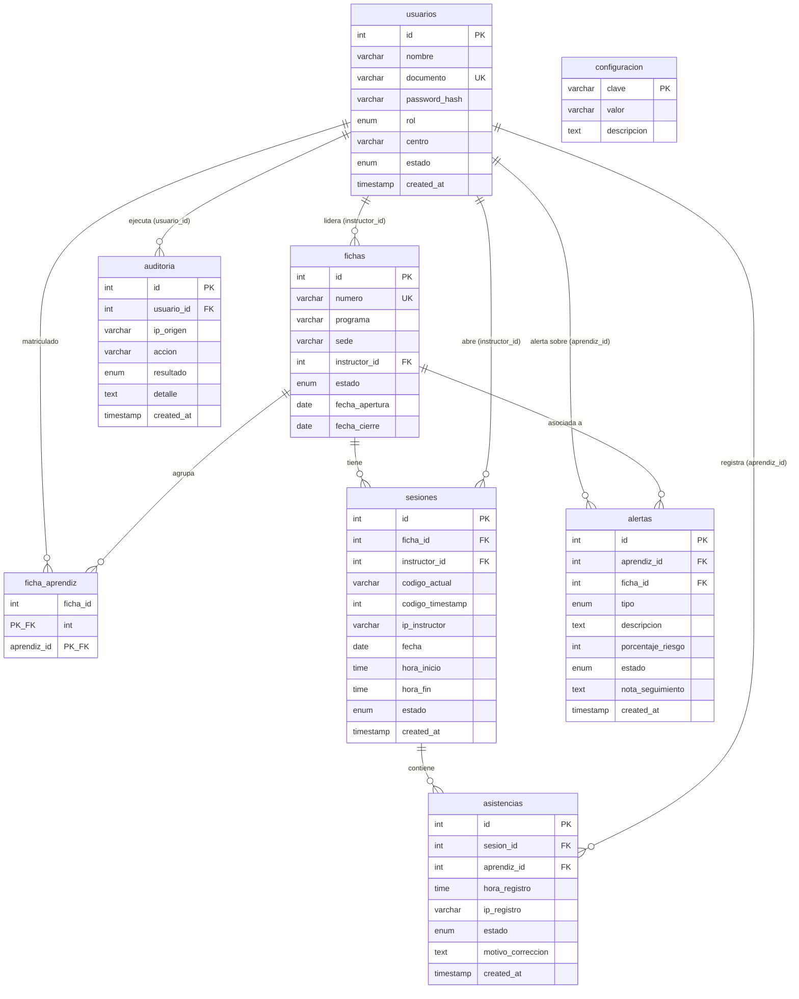

# Modelo Entidad-Relaci?n F?sico

> Estado: ?? Estable | ?ltima actualizaci?n: 2026-09-18
> Autor: Equipo de Desarrollo | Equipo: An?lisis y Desarrollo de Software (SENA)

El sistema opera sobre una base de datos relacional MySQL / TiDB Cloud compuesta por 8 tablas estructuradas en tercera forma normal (3NF):

## ?ndices y Restricciones Clave:
- `usuarios.documento`: Clave ?nica para evitar registros duplicados de aprendices o instructores.
- `fichas.numero`: Clave ?nica institucional.
- `asistencias.unique_sesion_aprendiz`: Restricci?n `UNIQUE KEY (sesion_id, aprendiz_id)` que garantiza a nivel de motor de base de datos la imposibilidad de dobles asistencias en la misma sesi?n.
